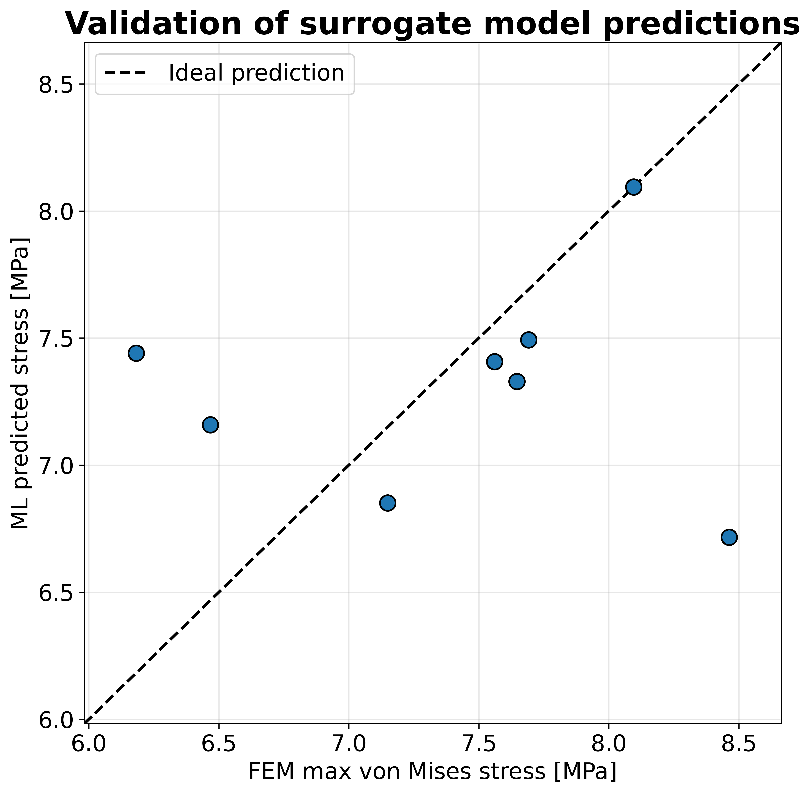
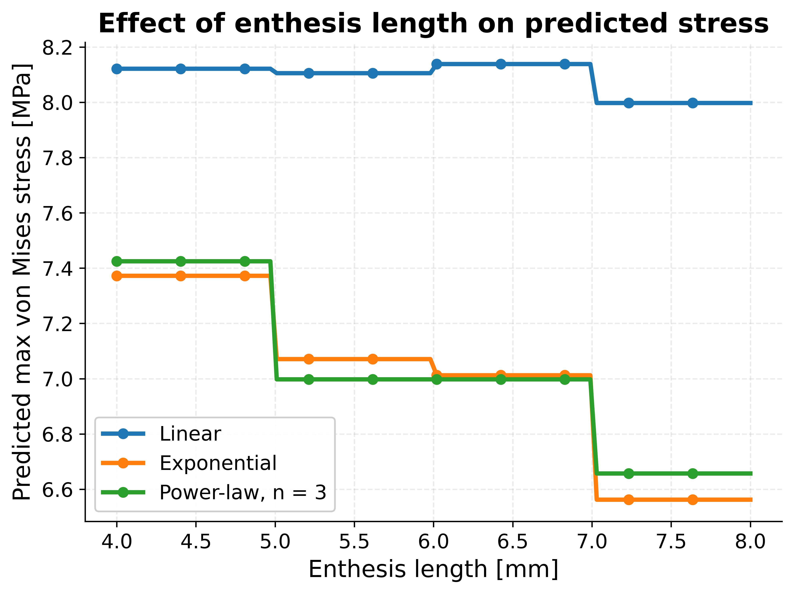
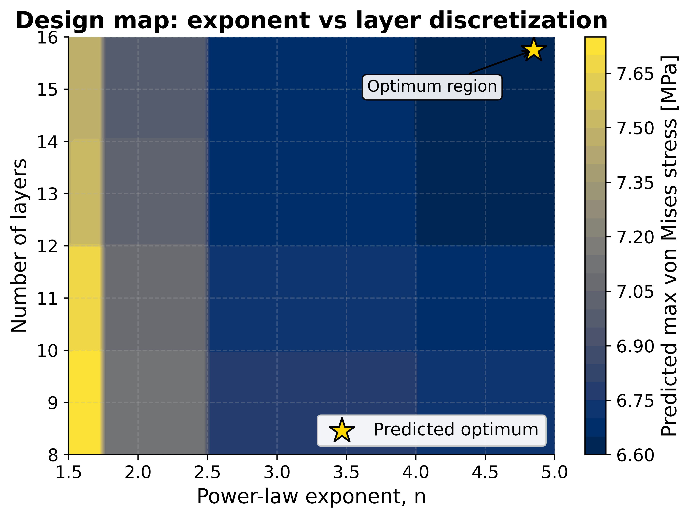
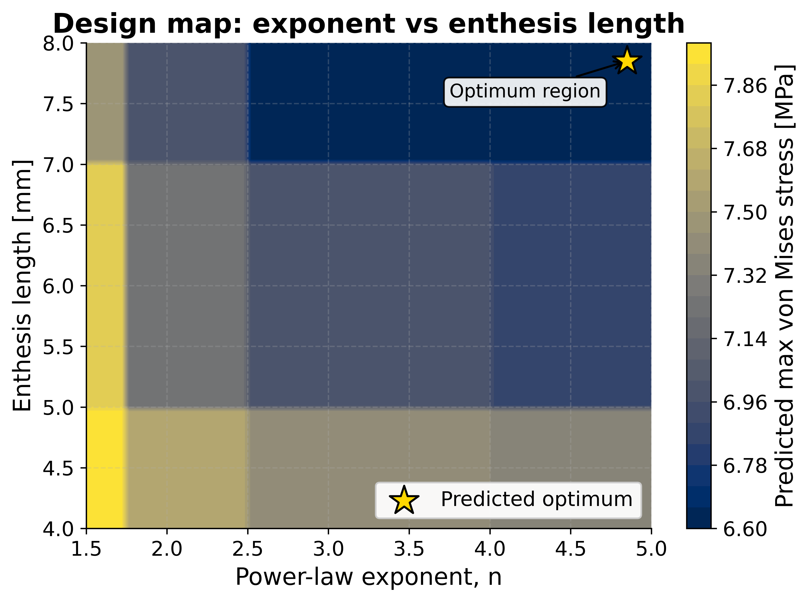
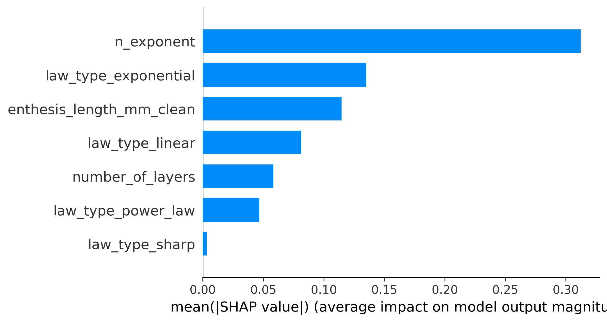
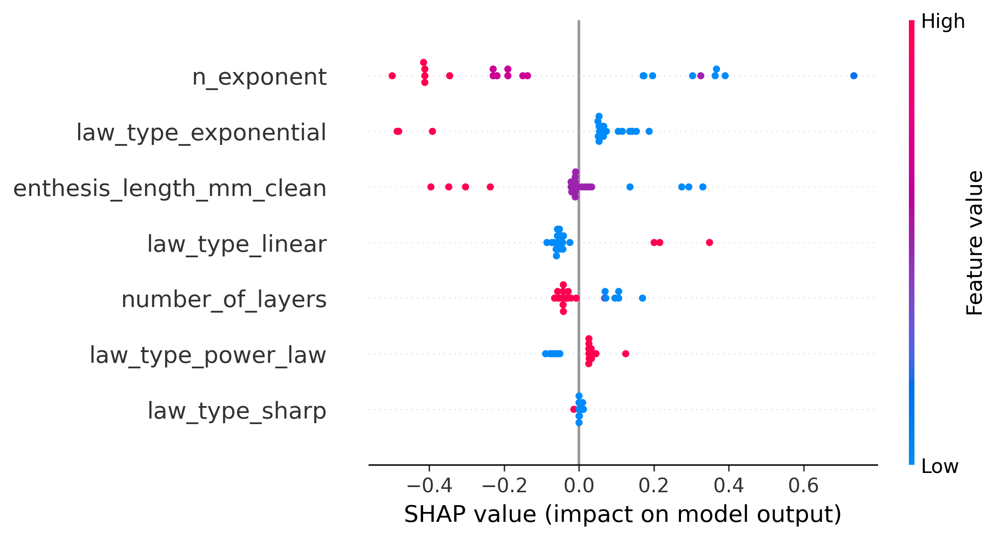

# Enthesis Surrogate Model  
## Machine Learning-Assisted Design Exploration of Functionally Graded Tendon-to-Bone Interfaces


---

# Overview

This project extends the previous **Enthesis FEM Model** study, where different functionally graded material (FGM) transition laws were investigated through finite element simulations of the tendon-to-bone interface (enthesis).

The original FEM analysis showed that graded interfaces can significantly reduce stress concentrations compared to abrupt material transitions. However, exploring large design spaces exclusively through FEM rapidly becomes computationally expensive.

The objective of this second project was therefore to develop a **surrogate machine learning framework** capable of predicting the mechanical response of graded enthesis configurations directly from design parameters, reducing the need for repeated finite element simulations while preserving biomechanical interpretability.

The project combines:

- Finite Element Modeling (FEM)
- Parametric dataset generation
- Machine learning regression
- Explainable AI (SHAP)
- Design-space exploration
- Engineering-oriented visualization

---

# Connection with the Previous FEM Project

The surrogate model was entirely built upon the simulation campaign developed in the original FEM investigation, which included:

- sharp interfaces
- linear graded transitions
- exponential graded transitions
- power-law graded transitions

The original models were created in Abaqus and post-processed using Python and MATLAB workflows. Mechanical descriptors and stress metrics extracted from those simulations were then organized into a structured dataset suitable for machine learning applications.

This creates a direct connection between the two projects:

```text
Project 1:
Physics-driven FEM investigation

        ↓

Project 2:
Data-driven surrogate modeling and optimization
```

---

# Project Workflow

```text
Abaqus FEM simulations
        ↓
Python extraction of mechanical metrics
        ↓
Dataset construction
        ↓
Feature engineering
        ↓
Machine learning surrogate model
        ↓
Validation against FEM data
        ↓
SHAP interpretability analysis
        ↓
Design maps and optimization trends
```

---

# Methodology

## Parametric FEM Dataset

A series of finite element models was generated by varying:

- transition law type
- power-law exponent \( n \)
- enthesis length
- number of discretization layers

The simulations provided stress distributions and global mechanical descriptors, with the maximum von Mises stress selected as the primary surrogate target variable.

Additional extracted quantities included interface stress metrics, stress gradients, stress curvature, and area-based indicators describing the mechanical response of the graded interface.

---

## Machine Learning Surrogate Model

A regression-based surrogate model was trained to predict the mechanical response of the interface directly from its design parameters.

The input features included:

- transition law type
- power-law exponent
- enthesis length
- number of layers

The goal was not only prediction accuracy, but also the development of an interpretable engineering tool capable of supporting biomechanical design exploration.

Several regression strategies were explored, with Random Forest models providing the best overall balance between accuracy and robustness for the available dataset size.

---

# Validation Against FEM Simulations

The surrogate predictions were compared against FEM-generated results in order to evaluate the model generalization capability.

## Validation Plot



The surrogate successfully captured the overall trends of the finite element simulations despite the relatively limited dataset size. The largest discrepancies appeared in highly nonlinear regions of the parameter space, highlighting the importance of additional simulations for future refinement.

Most importantly, the workflow closed the complete loop:

```text
FEM → dataset → machine learning → validation → FEM confirmation
```

demonstrating that the surrogate model can effectively support biomechanical design exploration.

---

# Design Space Exploration

One of the major advantages of the surrogate approach is the possibility to rapidly investigate large parameter spaces without rerunning FEM simulations for every configuration.

## Effect of Enthesis Length



The results indicate that increasing enthesis length generally reduces peak stress concentrations for graded configurations, while linear transitions remain mechanically less effective.

---

# Design Maps

## Exponent vs Layer Discretization



## Exponent vs Enthesis Length



The design maps reveal a clear optimal region associated with:

- higher power-law exponents
- smoother graded transitions
- increased enthesis length
- refined discretization

These trends are fully consistent with the observations obtained in the original FEM investigation, suggesting that the surrogate model learned physically meaningful biomechanical relationships rather than simply interpolating numerical data.

---

# Explainable AI (SHAP Analysis)

SHAP analysis was used to understand which parameters most strongly influence the surrogate model predictions.

## Feature Importance



The analysis identified the power-law exponent and the enthesis length as the dominant biomechanical parameters, while the number of layers showed a comparatively smaller influence.

---

## SHAP Summary Plot



The SHAP summary confirms that:

- higher exponents generally reduce predicted stress concentrations
- smoother graded transitions improve load transfer
- sharp transitions remain mechanically unfavorable

This interpretability step was fundamental to ensure that the surrogate model remained physically meaningful and not simply a black-box regression tool.

---

# Key Results

- Random Forest achieved the best overall surrogate performance among the tested regression models.
- High power-law exponents combined with long enthesis regions minimized stress concentrations.
- The surrogate model successfully generalized to unseen FEM configurations.
- SHAP analysis identified stiffness gradient shape as the dominant factor controlling stress redistribution.
- The workflow successfully connected physics-based simulations and AI-driven biomechanical design exploration.

---

# Limitations

Several limitations should be acknowledged.

The dataset size remains relatively small, and the FEM model is intentionally simplified and two-dimensional in order to isolate the influence of the material gradient. Material behavior was modeled as purely linear elastic, and the surrogate model is therefore only valid within the explored design space.

Future developments may include:

- nonlinear constitutive models
- fracture mechanics
- fatigue analysis
- probabilistic approaches
- topology optimization
- neural-network-based surrogate strategies

---

# Software and Tools

- Abaqus/CAE
- Python
- NumPy
- pandas
- matplotlib
- scikit-learn
- SHAP

---

# Author

**Federico Tremolada**  
Biomedical Engineer — Politecnico di Milano  
